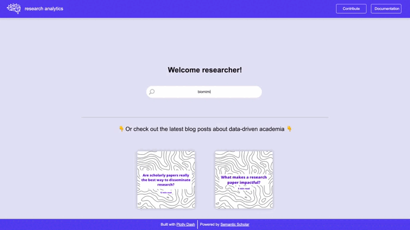

# Welcome to Research Analytics 🧠

**Research Analytics** is an Open Source project helping academic researchers and students with their daily research activities.
The app can be accessed [here](https://research-analytics.herokuapp.com/).

For a full project description please visit [Research Analytics](https://jhupiterz.notion.site/Welcome-to-research-intelligence-a36796f418b040f6ade944f9c54e87cb).

### App preview 👁️

### Package installation 🔽

If you wish to use the research analytics app on your machine (run it locally), you can simply clone this GitHub repository by running the following command in your terminal (command prompt):

`$ git clone https://github.com/jhupiterz/research-analytics`

### Run the app locally 💻

Once the repo is cloned, make sure to be in the right directory on your machine and run the following command:

`$python dashboard.py`

The Python file will open a local port in your default browser and you'll be able to use the app.
If not, simply copy and paste the link that popped in your terminal (should look like ~ http://127.0.0.1:8050/).

### App documentation

A full documentation of how to use the app is available [here](https://www.notion.so/jhupiterz/Research-Analytics-dda8cbc930db498ba054f7ec2bb57dcc).
